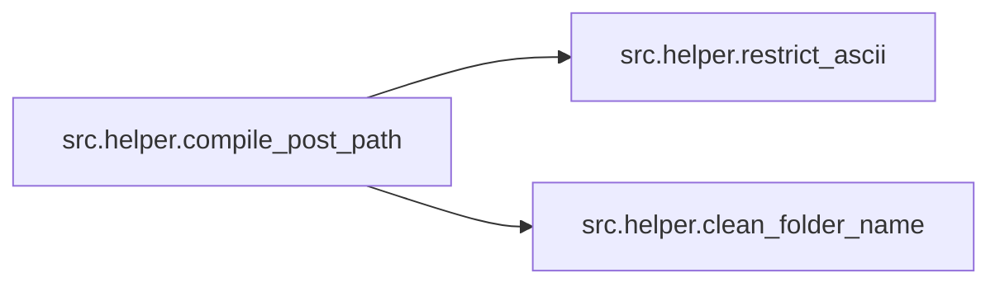
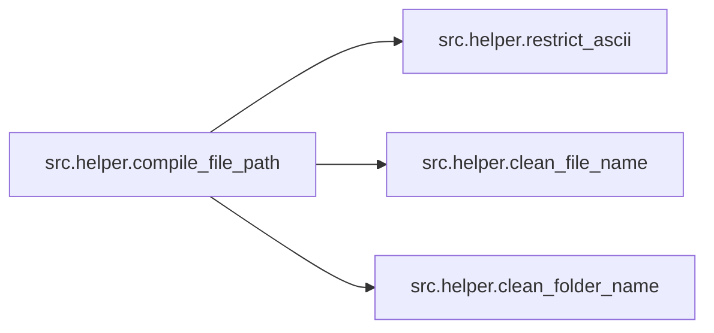

# Src Helper

[_Documentation generated by Documatic_](https://www.documatic.com)

<!---Documatic-section-Codebase Structure-start--->
## Codebase Structure

<!---Documatic-block-system_architecture-start--->
```mermaid
None
```
<!---Documatic-block-system_architecture-end--->

# #
<!---Documatic-section-Codebase Structure-end--->

<!---Documatic-section-src.helper.parse_url-start--->
## [src.helper.parse_url](6-src_helper.md#src.helper.parse_url)

<!---Documatic-section-parse_url-start--->
<!---Documatic-block-src.helper.parse_url-start--->
<details>
	<summary><code>src.helper.parse_url</code> code snippet</summary>

```python
def parse_url(url):
    downloadable = re.search('^https://(kemono\\.party|coomer\\.party)/([^/]+)/user/([^/]+)($|/post/([^/]+)$)', url)
    if not downloadable:
        return None
    return downloadable.group(1)
```
</details>
<!---Documatic-block-src.helper.parse_url-end--->
<!---Documatic-section-parse_url-end--->

# #
<!---Documatic-section-src.helper.parse_url-end--->

<!---Documatic-section-src.helper.compile_post_path-start--->
## [src.helper.compile_post_path](6-src_helper.md#src.helper.compile_post_path)

<!---Documatic-section-compile_post_path-start--->


### Object Calls

* [src.helper.restrict_ascii](6-src_helper.md#src.helper.restrict_ascii)
* [src.helper.clean_folder_name](6-src_helper.md#src.helper.clean_folder_name)

<!---Documatic-block-src.helper.compile_post_path-start--->
<details>
	<summary><code>src.helper.compile_post_path</code> code snippet</summary>

```python
def compile_post_path(post_variables, template, ascii):
    (drive, tail) = os.path.splitdrive(template)
    tail = tail[1:] if tail[0] in {'/', '\\'} else tail
    tail_split = re.split('\\\\|/', tail)
    cleaned_path = drive + os.path.sep if drive else ''
    for folder in tail_split:
        if ascii:
            cleaned_path = os.path.join(cleaned_path, restrict_ascii(clean_folder_name(folder.format(**post_variables))))
        else:
            cleaned_path = os.path.join(cleaned_path, clean_folder_name(folder.format(**post_variables)))
    return cleaned_path
```
</details>
<!---Documatic-block-src.helper.compile_post_path-end--->
<!---Documatic-section-compile_post_path-end--->

# #
<!---Documatic-section-src.helper.compile_post_path-end--->

<!---Documatic-section-src.helper.compile_file_path-start--->
## [src.helper.compile_file_path](6-src_helper.md#src.helper.compile_file_path)

<!---Documatic-section-compile_file_path-start--->


### Object Calls

* [src.helper.restrict_ascii](6-src_helper.md#src.helper.restrict_ascii)
* [src.helper.clean_file_name](6-src_helper.md#src.helper.clean_file_name)
* [src.helper.clean_folder_name](6-src_helper.md#src.helper.clean_folder_name)

<!---Documatic-block-src.helper.compile_file_path-start--->
<details>
	<summary><code>src.helper.compile_file_path</code> code snippet</summary>

```python
def compile_file_path(post_path, post_variables, file_variables, template, ascii):
    file_split = re.split('\\\\|/', template)
    if len(file_split) > 1:
        for folder in file_split[:-1]:
            if ascii:
                post_path = os.path.join(post_path, restrict_ascii(clean_folder_name(folder.format(**file_variables, **post_variables))))
            else:
                post_path = os.path.join(post_path, clean_folder_name(folder.format(**file_variables, **post_variables)))
    if ascii:
        cleaned_file = restrict_ascii(clean_file_name(file_split[-1].format(**file_variables, **post_variables)))
    else:
        cleaned_file = clean_file_name(file_split[-1].format(**file_variables, **post_variables))
    return os.path.join(post_path, cleaned_file)
```
</details>
<!---Documatic-block-src.helper.compile_file_path-end--->
<!---Documatic-section-compile_file_path-end--->

# #
<!---Documatic-section-src.helper.compile_file_path-end--->

<!---Documatic-section-src.helper.get_file_hash-start--->
## [src.helper.get_file_hash](6-src_helper.md#src.helper.get_file_hash)

<!---Documatic-section-get_file_hash-start--->
<!---Documatic-block-src.helper.get_file_hash-start--->
<details>
	<summary><code>src.helper.get_file_hash</code> code snippet</summary>

```python
def get_file_hash(file: str):
    sha256_hash = hashlib.sha256()
    with open(file, 'rb') as f:
        for byte_block in iter(lambda : f.read(4096), b''):
            sha256_hash.update(byte_block)
    return sha256_hash.hexdigest().lower()
```
</details>
<!---Documatic-block-src.helper.get_file_hash-end--->
<!---Documatic-section-get_file_hash-end--->

# #
<!---Documatic-section-src.helper.get_file_hash-end--->

<!---Documatic-section-src.helper.clean_folder_name-start--->
## [src.helper.clean_folder_name](6-src_helper.md#src.helper.clean_folder_name)

<!---Documatic-section-clean_folder_name-start--->
<!---Documatic-block-src.helper.clean_folder_name-start--->
<details>
	<summary><code>src.helper.clean_folder_name</code> code snippet</summary>

```python
def clean_folder_name(folder_name: str):
    if not folder_name.rstrip():
        folder_name = '_'
    return re.sub('[\\x00-\\x1f\\\\/:\\"*?<>\\|]|\\.$', '_', folder_name.rstrip())[:248]
```
</details>
<!---Documatic-block-src.helper.clean_folder_name-end--->
<!---Documatic-section-clean_folder_name-end--->

# #
<!---Documatic-section-src.helper.clean_folder_name-end--->

<!---Documatic-section-src.helper.clean_file_name-start--->
## [src.helper.clean_file_name](6-src_helper.md#src.helper.clean_file_name)

<!---Documatic-section-clean_file_name-start--->
<!---Documatic-block-src.helper.clean_file_name-start--->
<details>
	<summary><code>src.helper.clean_file_name</code> code snippet</summary>

```python
def clean_file_name(file_name: str):
    if not file_name:
        file_name = '_'
    file_name = re.sub('[\\x00-\\x1f\\\\/:\\"*?<>\\|]', '_', file_name)
    (file_name, file_extension) = os.path.splitext(file_name)
    return file_name[:255 - len(file_extension) - 5] + file_extension
```
</details>
<!---Documatic-block-src.helper.clean_file_name-end--->
<!---Documatic-section-clean_file_name-end--->

# #
<!---Documatic-section-src.helper.clean_file_name-end--->

<!---Documatic-section-src.helper.restrict_ascii-start--->
## [src.helper.restrict_ascii](6-src_helper.md#src.helper.restrict_ascii)

<!---Documatic-section-restrict_ascii-start--->
<!---Documatic-block-src.helper.restrict_ascii-start--->
<details>
	<summary><code>src.helper.restrict_ascii</code> code snippet</summary>

```python
def restrict_ascii(string: str):
    return re.sub('[^\\x21-\\x7f]', '_', string)
```
</details>
<!---Documatic-block-src.helper.restrict_ascii-end--->
<!---Documatic-section-restrict_ascii-end--->

# #
<!---Documatic-section-src.helper.restrict_ascii-end--->

<!---Documatic-section-src.helper.check_date-start--->
## [src.helper.check_date](6-src_helper.md#src.helper.check_date)

<!---Documatic-section-check_date-start--->
<!---Documatic-block-src.helper.check_date-start--->
<details>
	<summary><code>src.helper.check_date</code> code snippet</summary>

```python
def check_date(post_date, date, datebefore, dateafter):
    if date:
        if date == post_date:
            return False
    if datebefore and dateafter:
        if dateafter <= post_date <= datebefore:
            return False
    elif datebefore:
        if datebefore >= post_date:
            return False
    elif dateafter:
        if dateafter <= post_date:
            return False
    return True
```
</details>
<!---Documatic-block-src.helper.check_date-end--->
<!---Documatic-section-check_date-end--->

# #
<!---Documatic-section-src.helper.check_date-end--->

<!---Documatic-section-src.helper.print_download_bar-start--->
## [src.helper.print_download_bar](6-src_helper.md#src.helper.print_download_bar)

<!---Documatic-section-print_download_bar-start--->
<!---Documatic-block-src.helper.print_download_bar-start--->
<details>
	<summary><code>src.helper.print_download_bar</code> code snippet</summary>

```python
def print_download_bar(total: int, downloaded: int, resumed: int, start):
    time_diff = time.time() - start
    if time_diff == 0.0:
        time_diff = 1e-06
    done = 50
    rate = (downloaded - resumed) / time_diff
    eta = time.strftime('%H:%M:%S', time.gmtime((total - downloaded) / rate))
    if rate / 2 ** 10 < 100:
        rate = (round(rate / 2 ** 10, 1), 'KB')
    elif rate / 2 ** 20 < 100:
        rate = (round(rate / 2 ** 20, 1), 'MB')
    else:
        rate = (round(rate / 2 ** 30, 1), 'GB')
    if total:
        done = int(50 * downloaded / total)
        if total / 2 ** 10 < 100:
            total = (round(total / 2 ** 10, 1), 'KB')
            downloaded = round(downloaded / 2 ** 10, 1)
        elif total / 2 ** 20 < 100:
            total = (round(total / 2 ** 20, 1), 'MB')
            downloaded = round(downloaded / 2 ** 20, 1)
        else:
            total = (round(total / 2 ** 30, 1), 'GB')
            downloaded = round(downloaded / 2 ** 30, 1)
    elif downloaded / 2 ** 10 < 100:
        total = ('???', 'KB')
        downloaded = round(downloaded / 2 ** 10, 1)
    elif downloaded / 2 ** 20 < 100:
        total = ('???', 'MB')
        downloaded = round(downloaded / 2 ** 20, 1)
    else:
        total = ('???', 'GB')
        downloaded = round(downloaded / 2 ** 30, 1)
    bar_fill = '=' * done
    bar_empty = ' ' * (50 - done)
    overlap_buffer = ' ' * 15
    print(f'[{bar_fill}{bar_empty}] {downloaded}/{total[0]} {total[1]} at {rate[0]} {rate[1]}/s ETA {eta}{overlap_buffer}', end='\r')
```
</details>
<!---Documatic-block-src.helper.print_download_bar-end--->
<!---Documatic-section-print_download_bar-end--->

# #
<!---Documatic-section-src.helper.print_download_bar-end--->

[_Documentation generated by Documatic_](https://www.documatic.com)